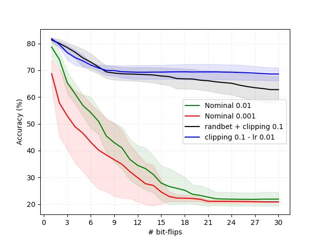

# cardIAc - Bit Flip Attack  

## Sources :  

Ce répertoire complète le projet [cardIAc](https://github.com/kez97460/cardIAc) et est un fork du tutoriel [🎯 Tutorial 🎯 Adversarial Weight Attack](https://gitlab.emse.fr/securityml/tutorial-adversarial-weight-attack/) réalisé par M. Kévin HECTOR et M. Pierre-Alain MOELLIC.  

## Objectif du projet :  

Dans le cadre de notre portage d’un réseau de neurones convolutifs (CNN) sur une plateforme STM32 pour la détection d’anomalies cardiaques, nous avons exploré les problématiques de sécurité propres aux réseaux de neurones en machine learning.  

Ce répertoire vise à démontrer les vulnérabilités potentielles des intelligences artificielles (IA) en simulant une attaque ciblée contre notre propre projet. 

Ici, nous mettons en œuvre une approche basée sur une *"bit flip attack"* (attaque par inversion de bit en français). Ces attaques, bien que simulées, reflètent des menaces réelles dans des contextes où les modèles sont déployés sur du matériel sensible, comme des microcontrôleurs utilisés en milieu médical.  

## Principes généraux de l’attaque :  

Une *bit flip attack* est une attaque physique qui intervient lors de l'inférence, c’est-à-dire pendant l’exécution finale de notre réseau de neurones. L’objectif de cette attaque est de modifier intentionnellement un ou plusieurs bits au sein des poids du réseau ou des données manipulées, afin d’altérer le comportement du modèle et d'induire des erreurs potentiellement critiques en peu de bits.

L’efficacité de ces attaques dépend fortement des poids ciblés au sein des neurones de notre réseau. De manière intuitive, l’idée est de concentrer l’attaque sur les bits de poids fort des poids les plus importants du réseau, car ce sont eux qui ont le plus d’influence sur la sortie du modèle.

## Architecture du projet :  

Le réseau de neurones CNN original, développé pour le projet [cardIAc](https://github.com/kez97460/cardIAc/tree/main/neural_network), a été adapté pour permettre l’intégration d’une couche de simulation d'attaques.  

Ce fichier peut être consulté via ce [lien](https://github.com/Zeug555/cardIAc_bit_flip_attack/blob/main/models/quan_mit_bih.py).  

Après entraînement avec le programme [train_cnn.py](https://github.com/Zeug555/cardIAc_bit_flip_attack/blob/main/train_cnn.py) et après l'avoir attaqué avec le programme [bfa_cnn.py](https://github.com/Zeug555/cardIAc_bit_flip_attack/blob/main/bfa_cnn.py), on affiche le résultat avec [printing_tools_cnn.py](https://github.com/Zeug555/cardIAc_bit_flip_attack/blob/main/printing_tools_cnn.py).

L'idée des simulations est de voir l'influence des attaques sur la précision de notre modèle. Cependant elle permet également d'entrainer notre modèle avec des protections permettant de faire face à cet archétype d'attaque.

On possède donc deux variables `clipping_value` et `randbet`.

`clipping_value` : Nous permet de limiter les valeurs des poids, il garantit que les attaques restent réalistes et gérables tout en évitant des comportements aberrants dus à des inversions extrêmes de bits.

`randbet` : Cette variable ajoute de l’aléatoire dans le choix des bits ciblés, nous donnant les résultat d'une attaque sans ciblage de poids spécifiques.

## Résultats :

On observe que les attaques sont très efficaces en peu de flip de bits avec les modèles sans protections (ils perdent tout deux plus de 40% de précisions en seulement 10 bits) lorsque les modèles avec entrainement par *clipping_value* sont bien plus robustes bien que pas infaillibles.

Une anomalie cependant est d'observé qu'une attaque aléatoire est plus efficace sur notre modèle qu'une attaque ciblée.
